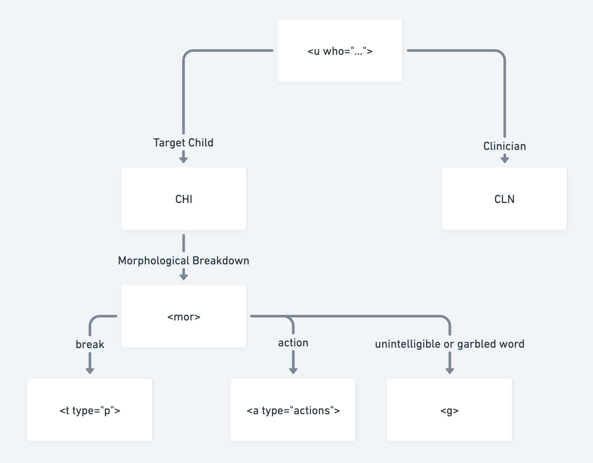

## CHILDES (Data's Origin)

Utilizing Natural Language Processing was crucial for accessing open text data. Following Lee's research approach, the CHILDES database (http://childes.talkbank.org/) was identified as a valuable resource. CHILDES offers labeled text transcripts for individuals with Autism Spectrum Disorder, Specific Language Impairment, or Typical Development. This data is instrumental in classifying children according to these categories.

## How to Access Data
The text file referenced from Lee's GitHub https://github.com/jamsawamsa/Autism_SLI_textAnalyzer_NLP_ML is inside this folder under the tile of plain_text.7z and xml.7z. This project will be using the same exact data.

- [x] Download the two .7z files and extract them into your working directory:
* plain_text.7z (Gathering of the only plain text conversation without labels)
* xml.7z (Gathering of the same conversation but with labels)

- [x] Unzip the data and have the whole folders of plain_text.7z and xml.7z inside your working folder.
* The text transcript files inside the plain_text.7z and xml.7z are already classified in the folder of "asd", "sli", and "td."
* Making sure nothing is altered within these files is essential

### Simple Example Layout of the XML data structure

### xml.7z's Important Labels'

| Label            | Description | Example |
|------------------|-------------|---------|
| `<a type="actions">` | Denotes an action or a non-verbal activity. | `<a type="actions">sits in a chair</a>` |
| `<u who="...">`  | Represents an utterance by a specific speaker. | `<u who="CHI" uID="u1">...</u>` |
| `<w>`            | Represents individual words within an utterance, often with morphological analysis. | `<u who="CLN"><w>Chi<mor type="mor">...</mor></w> <w>has<mor type="mor">...</mor></w></u>` |
| `<mor>`          | Provides a morphological breakdown of the word. | `<w>puppy<mor type="mor"><stem>puppy</stem></mor></w>` |
| `<t type="p">`   | Possibly indicates a pause or break in speech, especially following unintelligible utterances. | `<u who="CHI"><g><w untranscribed="unintelligible">yyy</w></g><t type="p"></t></u>` |
| `<g>`            | Indicates an unintelligible or garbled word. | `<u who="CHI"><g><w untranscribed="unintelligible">yyy</w></g></u>` |
| `<e>`            | Represents an action or event without speech. | `<u who="CHI"><e><action/></e></u>` |
| `<comment>`      | Additional notes or context about the activities. | `<comment type="Activities">playing with blocks</comment>` |

