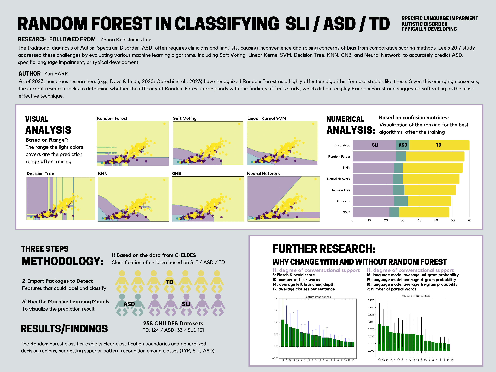

# Random forest in Classifying Specific Language Impairment (SLI) / Autistic Specturm Disorder (ASD) / Typically Developing (TD)

## Project Information
   * **Author**: Yuri Park, Computation and Design - Digital Media, 2025, Duke Kunshan University
   * **Instructor**: Prof. Luyao Zhang, Duke Kunshan University
   * **Disclaimer**: Submissions to the Final Project for [STATS201 Introduction to Machine Learning for Social Science, 2023 Autumn Term (Seven Week - Second)](https://ms.pubpub.org/) instructed by Prof. Luyao Zhang at Duke Kunshan University
   * **Acknowledgments**: I extend my heartfelt appreciation to Professor Zhang for her thoughtful and unwavering guidance during my introduction to machine learning in her class. Her patience was invaluable, particularly when I struggled to settle on a research topic. I am grateful for her consistent support, including the extra office hours she generously dedicated to helping me overcome challenges. I also want to express my sincere thanks to my classmates for creating a supportive environment. Their constructive insights and suggestions played a pivotal role in refining my research, ensuring it became a comprehensive exploration with in-depth explanations. Together, Professor Zhang and my classmates have significantly contributed to my learning experience, and I am truly appreciative of their contributions.
   * **Project Summary**:
     * **Background/Motivation**: Building upon the insights from [Lee's research](https://github.com/jamsawamsa/Autism_SLI_textAnalyzer_NLP_ML.git), this study is motivated by Lee's 2016 findings, which noted, "Comparing the confusion matrices of all classifiers, it is observed that the ASD class has the lowest precision and F-measure across all classes, even after feature extraction" (Lee, 2016, pg. 33). Addressing this concern, the investigation aims to explore the potential of the Random Forest algorithm. This interest is further fueled by Dewi and Imah's 2020 research, which identifies the Random Forest algorithm as the best in classifying ASD in children and adolescents based on specificity and sensitivity values (Dewi & Imah, 2020, pg. 152).
     * **Research Question**: In the context of 2023, the Random Forest algorithm is widely recognized for its effectiveness in various case studies (e.g., Dewi & Imah, 2020; Qureshi et al., 2023). However, Lee's study, which did not incorporate Random Forest and instead endorsed soft voting as the most effective technique, serves as a valuable benchmark for assessing and comparing the efficacy of these methodologies. This study aims to answer the **research question**: _Can Random Forest surpass the consistently high-performing SVM, which attained an accuracy score of 87% +/- 3% in Lee's study (Lee, 2016, pg. 32)? Furthermore, how can the addition of Random Forest contribute to a deeper understanding of language impairment, propelling research advancements in this field?_
   * **Application Scenario**: As the early years are pivotal for speech development, particularly for preschoolers (3-5 years), timely identification of speech and language disorders during this developmental phase significantly enhances communication abilities and facilitates smoother transitions to school, ensuring faster adaptation to the norm. Consequently, with the research focusing on children's speech data and determining the most efficient algorithm, its applications are diverse and effective, ranging from clinical settings to developing AI friend robots tailored to children with language impairments.
   * **Methodology**: Basing the research on [Lee's work](https://github.com/jamsawamsa/Autism_SLI_textAnalyzer_NLP_ML.git), the methodology involves integrating a random forest algorithm into the pre-existing list of algorithms employed by Lee. Using the [scikit-learn Python toolkit for machine learning and data mining](https://scikit-learn.org/stable/), my approach focuses on determining the optimal parameter settings for the random forest. The methodology seeks to discern and apply the most effective parameters for the random forest within the scope of this research, facilitating a comparative analysis of its efficacy against other algorithms.
   * **Results**: Two key outcomes facilitate the comparison process. Firstly, employing the confusion matrix from sklearn allows us to evaluate the accuracy of machine learning algorithms by juxtaposing their predictions against the actual answers. Secondly, leveraging the classification tool from sklearn provides a visual representation of the accuracy range for each machine learning algorithm, particularly in the identification of SLI, ASD, and TD. Additionally, as a supplementary component, the report will highlight the most significant features identified after the complete classification process.
     * Ultimately, the findings revealed that the random forest algorithm performed exceptionally well, ranking as the best algorithm after the SoftVotingEnsembleMethod. Consequently, it is safe to conclude that the random forest demonstrates accurate predictions, aligning with reports from 2023 and validating Lee's research method as consistent with current trends.
    
   * **Intellectual Merit/Practical impact**: Having recognized the random forest as the most effective individual algorithm in this field of study, there is an opportunity for additional investigation to uncover the underlying reasons for its optimal performance. However, a more significant revelation arises from the minor findings: the identification of the most crucial features for detection. This discovery holds the potential to provide novel insights, offering valuable input for advancing the field. Understanding these indicative features can play a pivotal role in enhancing early detection efforts and other applications within the domain.

## Table of Contents
  * **[Literature](Literature/README.md)**: Review of relevant existing literature.
  * **[Method](Method/README.md)**: Description of the methodology employed in the research.
  * **Data**: Information about the data used in the study.
  * **Code**: Details related to the code or computational methods used.
  * **Results**: Presentation and analysis of the research findings.
  * **Spotlight**: A special section highlighting specific aspects of the research.
  * **More about the Author**: Information about the background and qualifications of the researcher.
  * **References**: Citations and sources used in the document.

## Spotlight

## More about the Author
I am an undergraduate student at Duke Kunshan University. Driven by a keen interest in education and a passion for effective communication, many of my projects aim to deliver informative and interactive messages. As I aspire to expand my capabilities in design, my curiosity and enthusiasm for machine learning led me to pursue this course.

My portfolio Website: yuripark.me

### Final reflections
  * **Intellectual growthh**: Acquiring knowledge in machine learning has provided me with a deeper understanding of its current applications. The utilization of machine learning and various packages has enabled the intricate comprehension and visualization of complex data. Its distinctive learning and prediction capabilities have broadened my perspective on what can be achieved within the realm of my design capabilities. Recognizing its potential for conducting causal inference has further piqued my interest, prompting a desire to explore the extent to which machine learning will revolutionize the world and continue to evolve.
  * **Professional growth**: Gaining a general understanding of machine learning has significantly contributed to my professional growth, enabling me to engage in discussions with a diverse range of designers and artists. Particularly, in light of the prevailing trend where many designers utilize machine learning as a tool to enhance their work, I view my decision to advance my professional growth in this direction as a meaningful step forward.
  * **Living a purposeful life**: In the future, I aspire to be acknowledged as a designer characterized by a commitment to care. Given that many of my projects center around improving the learning process and addressing global issues, I aim to be recognized within the design community as a leading advocate for compassionate design.

## References
### Data Source
  * **CHILDES**: https://childes.talkbank.org/
  * **Lee's Research**: https://github.com/jamsawamsa/Autism_SLI_textAnalyzer_NLP_ML.git

### Code Source
  * **Lee's Research**: https://github.com/jamsawamsa/Autism_SLI_textAnalyzer_NLP_ML.git

### Articles
### Literature

## Current Project's Goal
Under the inspiration of [Lee's research](https://github.com/jamsawamsa/Autism_SLI_textAnalyzer_NLP_ML.git), my research focuses on the potential of the Random Forest algorithm in addressing the conclusion from Lee's 2016 study, which stated: “Comparing the confusion matrices of all classifiers, it is observed that the ASD class has the lowest precision and F-measure across all classes, even after feature extraction” (Lee, 2016, pg. 33). I would like to know if precision for ASD can be improved as This interest is according to Dewi and Imah's 2020 research, it’s found that 'based on the specificity and sensitivity value, the Random Forest algorithm with full features is the best algorithm compared to others in classifying ASD in children and adolescents' (Dewi & Imah, 2020, pg. 152). Therefore, I am eager to explore whether Random Forest can not only solve the issues identified in Lee's study but also outperform the SVM, which was the most consistent and best-performing machine learning algorithm in Lee's research, with an accuracy score of 87% +/- 3% (Lee, 2016, pg. 32)."

# Project Action Overview
0. [Method](Method/Readme.md):
* Objective: Summarize the  Literature review that builds up to the ultimate conclusion to what research this project is going to be about

1. [Data-Query](Data/Data-Query): Organize Your Folder Structure
* Objective: Prepare and arrange your working directory for efficient data handling.
* Action: Ensure that all necessary files and folders are appropriately structured in your project directory.

2. [Data-Preprocessing & Data-Processing](Data/Data-Processing):
### Data-Preprocessing: Generate Output File 
* Objective: Preprocess the raw data to prepare it for further analysis.
* Action: Execute the driver_m.py script. This script processes the raw data and generates an intermediate file named "output_file". This file contains essential features extracted from the data and is crucial for the next step of the analysis.

### Data-Processing: Run Analysis and Generate Report
* Objective: Analyze the preprocessed data to extract insights.
* Action: Run the classifier_m.py script, which utilizes the "output_file" generated in the previous step. 

## Making the Research Beyond
For this project to continue, the following needs to be completed in the order of hierarchy
1. Implement the code based on Lee's research
2. Study the Random Forest ML equation and consider what is the parameter setting for Random Forest
