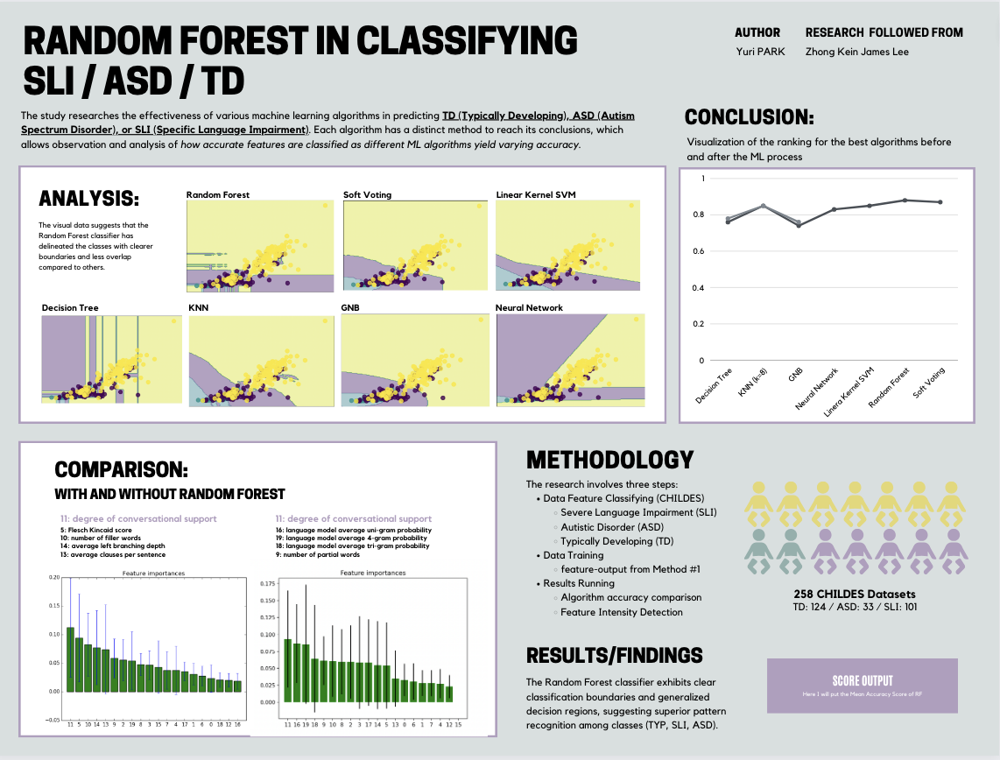

# Random forest in Classifying  SLI / ASD / TD

## Project Information
   * Unordered First
   * Unordered Second
   * Unordered Third

## Introduction
I am an undergraduate student from Duke Kunshan University.
With my special interest in education and passion in communication,
many of may projects involve communicating messages that are
educative at the same time, interactive. 
With using P5.Js mainly, most of the projects are done in JavaScript.

My portfolio (updating): https://fabulous-kleicha-2e1a9d.netlify.app/

## Current Project's Goal
Under the inspiration of [Lee's research](https://github.com/jamsawamsa/Autism_SLI_textAnalyzer_NLP_ML.git), my research focuses on the potential of the Random Forest algorithm in addressing the conclusion from Lee's 2016 study, which stated: “Comparing the confusion matrices of all classifiers, it is observed that the ASD class has the lowest precision and F-measure across all classes, even after feature extraction” (Lee, 2016, pg. 33). I would like to know if precision for ASD can be improved as This interest is according to Dewi and Imah's 2020 research, it’s found that 'based on the specificity and sensitivity value, the Random Forest algorithm with full features is the best algorithm compared to others in classifying ASD in children and adolescents' (Dewi & Imah, 2020, pg. 152). Therefore, I am eager to explore whether Random Forest can not only solve the issues identified in Lee's study but also outperform the SVM, which was the most consistent and best-performing machine learning algorithm in Lee's research, with an accuracy score of 87% +/- 3% (Lee, 2016, pg. 32)."

# Project Action Overview
0. [Method](Method/Readme.md):
* Objective: Summarize the  Literature review that builds up to the ultimate conclusion to what research this project is going to be about

1. [Data-Query](Data/Data-Query): Organize Your Folder Structure
* Objective: Prepare and arrange your working directory for efficient data handling.
* Action: Ensure that all necessary files and folders are appropriately structured in your project directory.

2. [Data-Preprocessing & Data-Processing](Data/Data-Processing):
### Data-Preprocessing: Generate Output File 
* Objective: Preprocess the raw data to prepare it for further analysis.
* Action: Execute the driver_m.py script. This script processes the raw data and generates an intermediate file named "output_file". This file contains essential features extracted from the data and is crucial for the next step of the analysis.

### Data-Processing: Run Analysis and Generate Report
* Objective: Analyze the preprocessed data to extract insights.
* Action: Run the classifier_m.py script, which utilizes the "output_file" generated in the previous step. The classifier_m script performs the data analysis and generates a comprehensive report titled "report.txt". This report contains the detailed results and findings of the analysis.

## Making the Research Beyond
For this project to continue, the following needs to be completed in the order of hierarchy
1. Implement the code based on Lee's research
2. Study the Random Forest ML equation and consider what is the parameter setting for Random Forest

# Whole Poster

